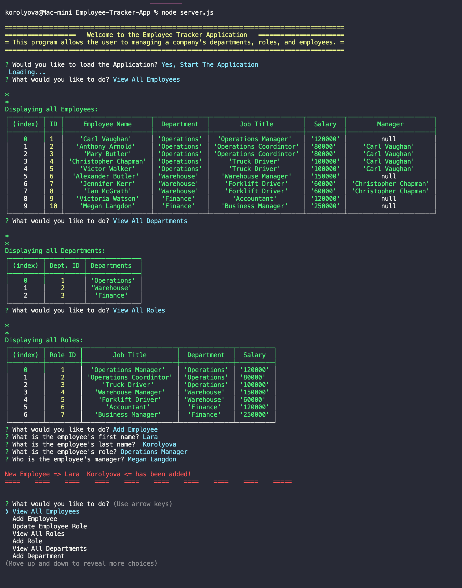

# Employee-Tracker-App

  
Table of Contents

  <ol>
    <li><a href="#description">Description</a></li>
    <li><a href="#features">Features</a></li>
    <li><a href="#technical-part">Technical Part</a>
        <ul>
            <li><a href="#demo">Demo</a></li>
            <li><a href="#installation">Installation</a></li>
            <li><a href="#usage">Usage</a></li>
            <li><a href="#contributing">Contributing</a></li>
        </ul>
    </li>
    <li><a href="#questions">Questions</a></li>
    <li><a href="#license">License</a></li>
    <li><a href="#notes">Notes</a></li>
  </ol>

## Description

A command line application Content Management Systems for managing a company's employees where it can view and manage the departments, roles, and employees.

## Features

- JavaScript
- Node.js
- MySQL
- npm
  - [mysql2](https://www.npmjs.com/package/mysql2)
  - [console.table](https://www.npmjs.com/package/console.table)
  - [Inquirer](https://www.npmjs.com/package/inquirer)

## Technical Part

### _Demo_

The following [video](https://drive.google.com/file/d/1vOzOd35xkSkwkOOlg82NJcg0tbXUF2ht/view?usp=sharing) demonstrates the functionality of the Application.

The screenshot below shows an example of the database:

    Terminal Command Lines

### _Installation_

1. Download or clone repository
2. [**Node.js**](https://nodejs.org/en/about/) is required to run the application
3. Run `npm install` to install the required npm packages

### _Usage_

- In the command line, run `npm run mysql` and enter your **MySQL** password when prompted
- Run `source db/schema.sql` in the **MySQL** shell.
- Run `source db/seeds.sql` in the **MySQL** shell to populate test data if desired.
- Run `quit` to exit out of the **MySQL** shell.

- Application is started by using the following command in the terminal:

  `node app.js`

- The user will be prompted to view, add and update information about Employees, Roles and Departments.

- Enjoy!

### _Contributing_

Pull requests are welcome. For major changes, please open an issue first to discuss what you would like to change, so I learn and understand it better.

Please make sure to update tests as appropriate, if applicable.

## Questions

- Checkout my [GitHub profile](https://github.com/KorolyovaLara)
- Any additional questions or feedback, feel free to [send an email](mailto:larakorolyova@gmail.com).

## License

Copyright (c) [Larysa Korolyova](https://www.linkedin.com/in/korolyova/). All rights reserved.

Licensed under the [MIT](https://github.com/KorolyovaLara/README-Generator/blob/main/LICENSE) license.

---

### Notes

Quote that recently inspired me:

> There is never a time or place for true love. It happens accidentally, in a heartbeat, in a single flashing, throbbing moment. -_Sarah Dessen_

---

© 2021 L Korolyova
